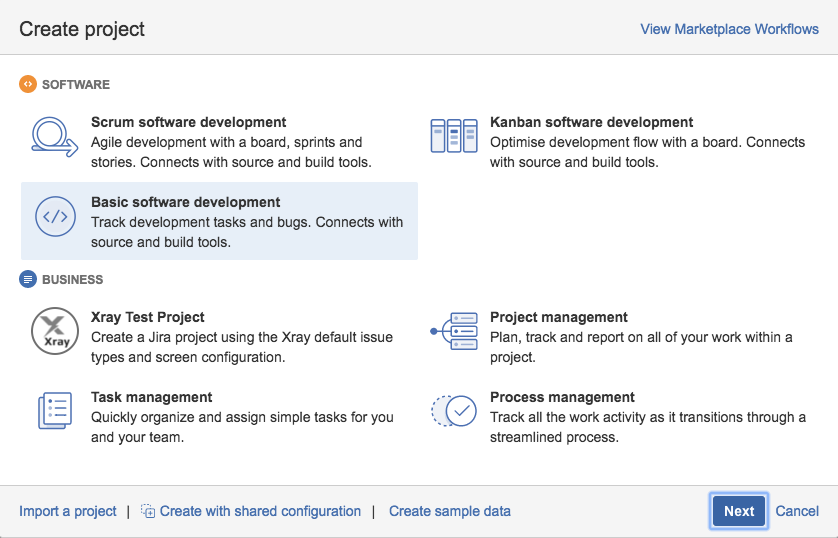

# Creating automated workflow for a JIRA project

Log in to [JIRA](https://jira.danskespil.dk), and create a Basic Software Development project to get the proper basic workflow.  Don't worry, we will make it Scrum or Kanban later, but we have to start this way.

The *Key* of the project is import because that is what will be used to link JIRA issues to branches in Git.  JIRA will suggest one for you:

After the project is created, you will need to setup the workflow:

The JIRA interface for editing the workflow is somewhat unituitive.  It displays different things depending on whether your are in edit mode or view mode, and whether your are in diagram mode or text mode.

When you click to edit on the workflow, you will be prompted your password to switch to administrator role.

To put triggers on the workflow, you need to be in diagram mode:

Click on the *IN PROGRESS* transition to get a menu to the right:

Click *triggers*:

And *Add Trigger*:

Specifically a *Branch Created* trigger.

Now the new trigger should be listed:

Continue to add one more triggers for sending an issue back to *IN PROGRESS* if a pull request is rejected:

Then publish the workflow, no need to create a backup:

Continue and create the rest of the triggers so that *Pull Request Created* and *Pull Request Merged* are use to transition issues:

Now your project will have triggers on the workflow, so that you can make the issues transition automatically be [using branches](../using-branches/using-branches-to-control-issues.md) in your project repository.

To set up a Scrum board, see [setting up a new project](../new-project/new-project-in-jira.md#make-a-scrum-board).
