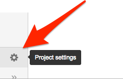
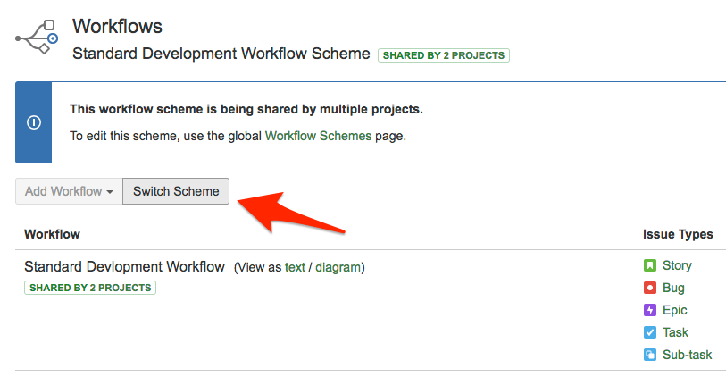
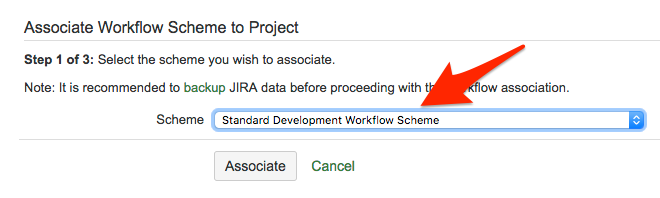

# Automating an existing JIRA project

Find your project in JIRA, and setup the workflow:

The JIRA interface for editing the workflow is somewhat unituitive.  It displays different things depending on whether your are in edit mode or view mode, and whether your are in diagram mode or text mode.

When you click to edit on the workflow, you will be prompted your password to switch to administrator role.

Now your project will have triggers on the workflow, so that you can make the issues transition automatically be [using branches](../using-branches/using-branches-to-control-issues.md) in your project repository.
