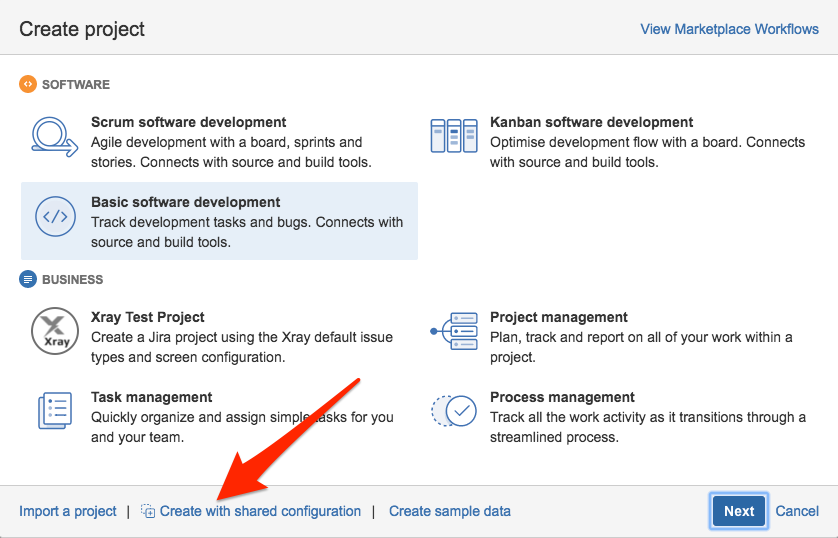
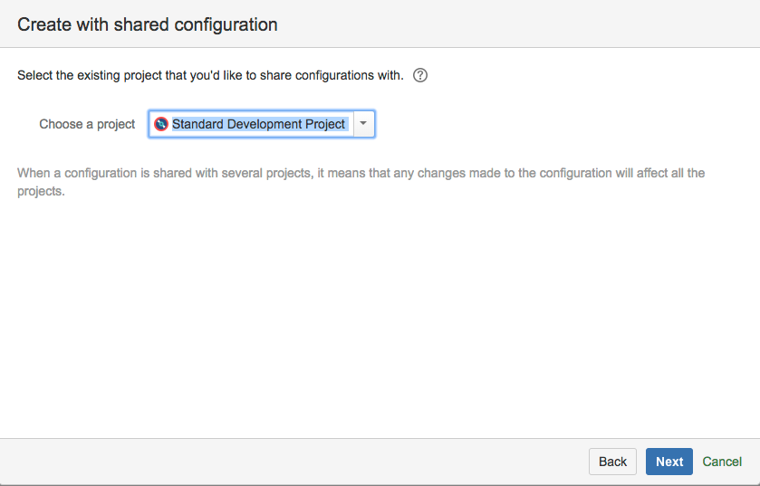
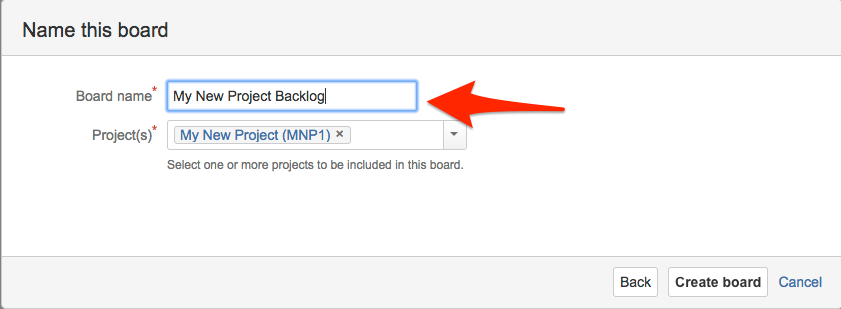
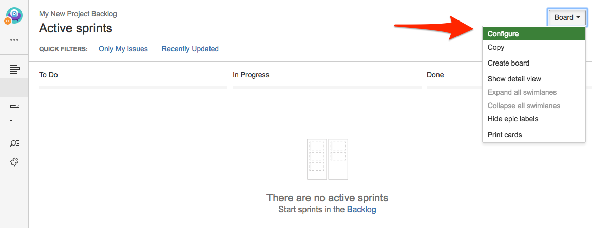
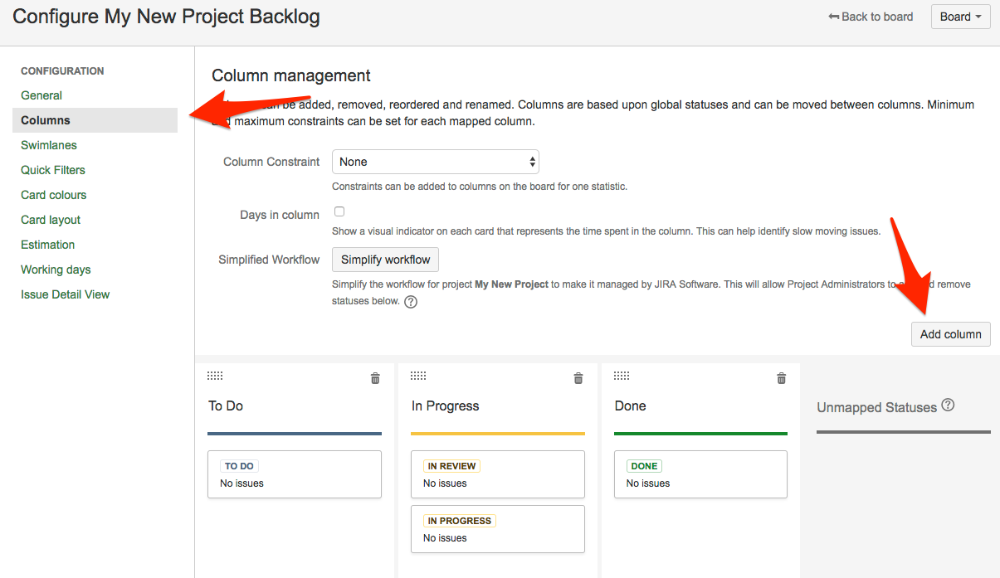
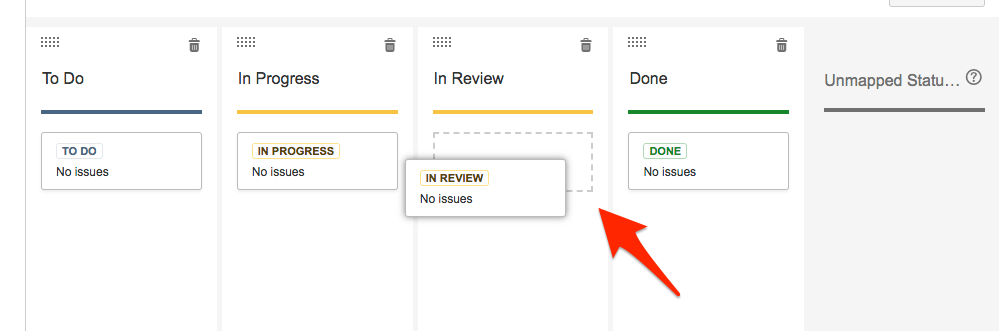

# How to create a new development project in Danske Spil's JIRA

Start with creating a repository for the source code.  That way JIRA have time to pick up on the existence of the repository.

Go to [Bitbucket](https://bitbucket.org/dsintegration/) and create a new repository:

Clone the repo, create a readme, and push it back to get started.  I do it this way, YMMV.

## Create new project

Log in to [JIRA](https://jira.danskespil.dk), and Create a project with shared configuration.

Use the Standard Development Project:

The *Key* of the project is import because that is what will be used to link JIRA issues to branches in Git.  JIRA will suggest one for you:

## Make a Scrum board

Create a board for your project, for instance a Scrum board:

Give the board a name that relates it to the project (because there are many boards in our JIRA):

The vanilla board is very simple, which is good, simple is good.  But you might want to add an extra column for In Review:

Add a column to the board, and drag the IN REVIEW status to the In Review column:

That is it, now you have a new Scrum project that automatically [tracks feature branches](../using-branches/using-branches-to-control-issues.md) in you Git repository.
