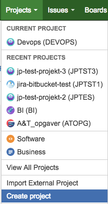
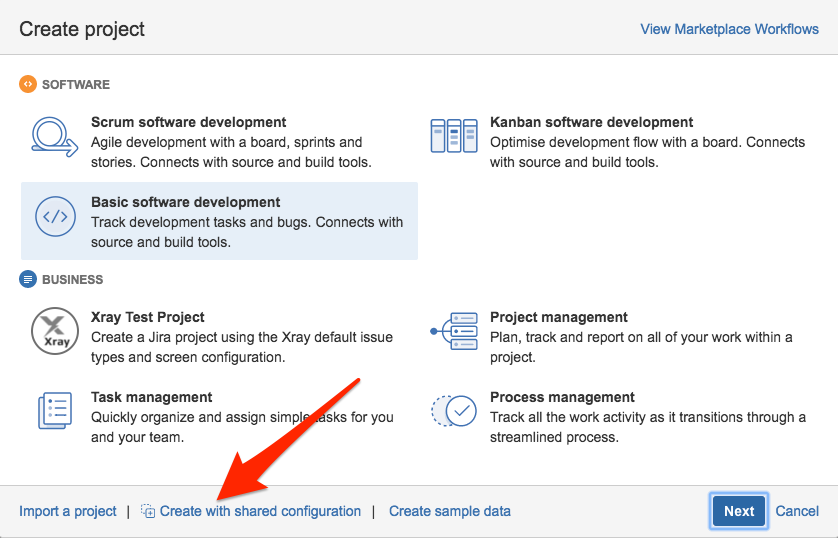
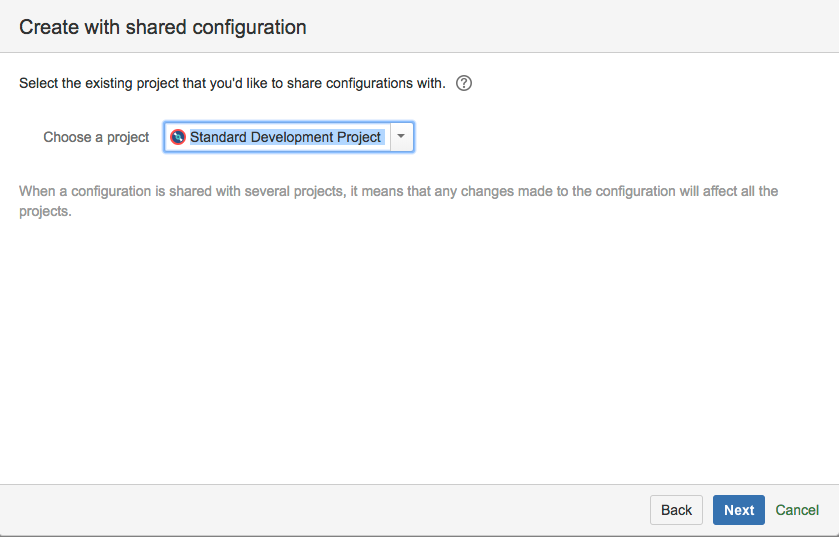
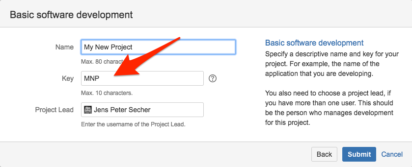
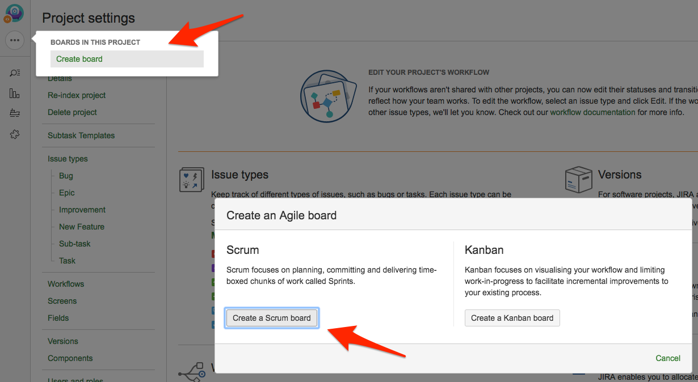
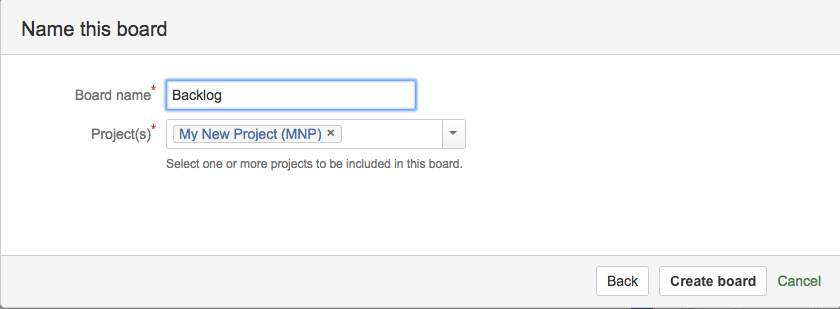
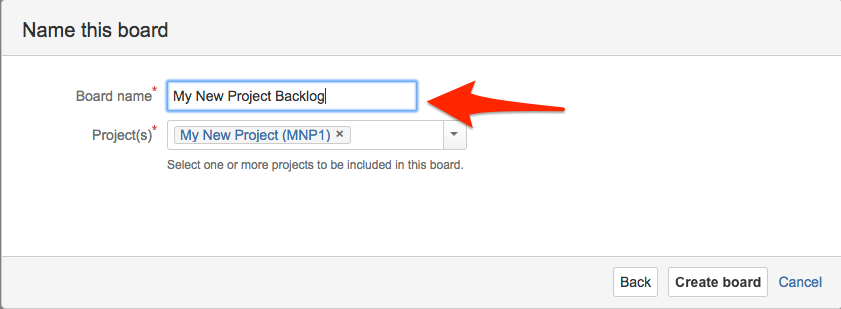

# How to create a new development project in Danske Spil's JIRA

Creating a project as described here will allow your team to use Branches and Pull Requests in your source-code repositories to automate the transition of issues in JIRA.  Specifically
- When you create a new branch for an issue/feature, the corresponding issue will automatically transition to *IN PROGRESS* in Jira.
- When you create a new pull request for a branch, the issue will transition to *REVIEW*.
- If a pull request is rejected, then the issue will transistion back to *IN PROGRESS*.
- When a pull request is merged back into *master*, the issue will transition to *DONE*.

This is part of a [greater effort](https://jira.danskespil.dk/jira/browse/DEVOPS-388) to get better release reports.

# Create new repository

Start with creating a repository for the source code.  That way JIRA have time to pick up on the existence of the repository.

Go to [Bitbucket](https://bitbucket.org/dsintegration/) and create a new repository:

Clone the repo, create a readme, and push it back to get started.  I do it this way, YMMV.

# Create new project

Log in to [JIRA](https://jira.danskespil.dk), and Create a project with shared configuration.

Use the Standard Development Project:

The *Key* of the project is import because that is what will be used to link JIRA issues to branches in Git.  JIRA will suggest one for you:

# Make a Scrum board

