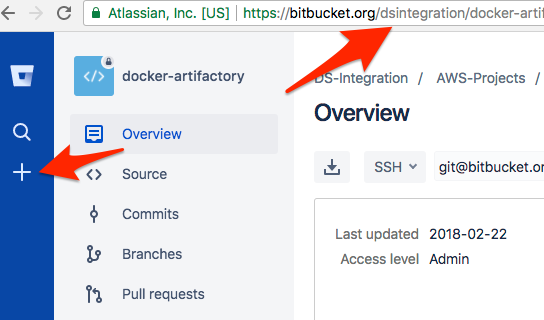

# How to create a new development project in Danske Spil's JIRA

Creating a project as described here will allow your team to use Branches and Pull Requests in your source-code repositories to automate the transition of issues in JIRA.  Specifically
- When you create a new branch for an issue/feature, the corresponding issue will automatically transition to *IN PROGRESS* in Jira.
- When you create a new pull request for a branch, the issue will transition to *REVIEW*.
- If a pull request is rejected, the issue will transistion back to *IN PROGRESS*.
- When a pull request is merged back into *master*, the issue wil transition to *DONE*.

This is part of a [greater effort](https://jira.danskespil.dk/jira/browse/DEVOPS-388) to get better release reports.

# Create new repository

This is just one way to create a new repository:

# Create new project

