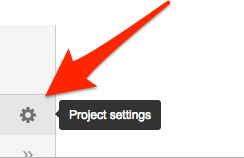
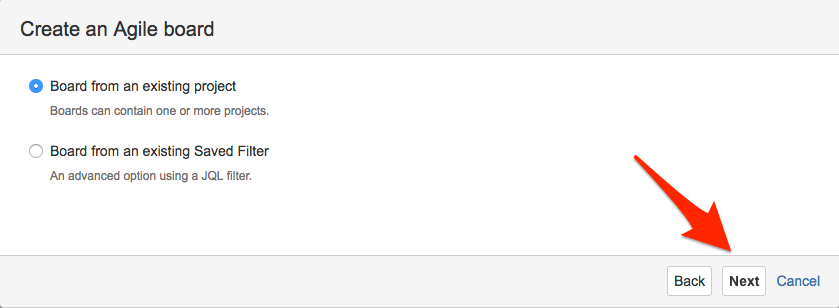

# How to create a new development project in Danske Spil's JIRA

Creating a project as described here will allow your team to use Branches and Pull Requests in your source-code repositories to automate the transition of issues in JIRA.  Specifically
- When you create a new branch for an issue/feature, the corresponding issue will automatically transition to *IN PROGRESS* in Jira.
- When you create a new pull request for a branch, the issue will transition to *REVIEW*.
- If a pull request is rejected, then the issue will transistion back to *IN PROGRESS*.
- When a pull request is merged back into *master*, the issue will transition to *DONE*.

This is part of a [greater effort](https://jira.danskespil.dk/jira/browse/DEVOPS-388) to get better release reports.

# Create new repository

Start with creating a repository for the source code.  That way JIRA have time to pick up on the existence of the repository.

Go to [Bitbucket](https://bitbucket.org/dsintegration/) and create a new repository:

Clone the repo, create a readme, and push it back to get started.

# Create new project

Log in to [JIRA](https://jira.danskespil.dk), and create a Basic Software Development project to get the proper basic workflow.  Don't worry, we will make it Scrum or Kanban later, but we have to start this way.

The *Key* of the project is import because that is what will be used to link JIRA issues to branches in Git.  JIRA will suggest one for you:

After the project is created, you will need to setup the workflow:

The JIRA interface for editing the workflow is somewhat unituitive.  It displays different things depending on whether your are in edit mode or view mode, and whether your are in diagram mode or text mode.

When you click to edit on the workflow, you will be prompted your password to switch to administrator role.

To put triggers on the workflow, you need to be in diagram mode:

Click on the *IN PROGRESS* transition to get a menu to the right:

Click *triggers*:

And *Add Trigger*:

Specifically a *Branch Created* trigger.

Now the new trigger should be listed:

Continue to add one more triggers for sending an issue back to *IN PROGRESS* if a pull request is rejected:

Then publish the workflow, no need to create a backup:

