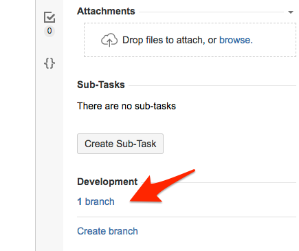
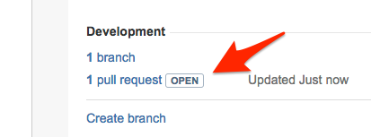
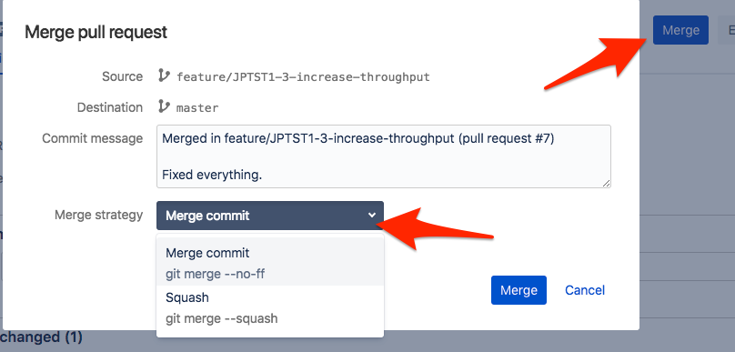
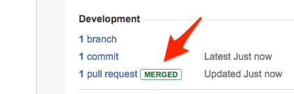

# Using branches to control issues in JIRA

When you have [setup your JIRA project to watch repository branches](../readme.md), you can control the transition of isues in JIRA by creating branches and pull requests through Bitbucket (or directly in Git).  This work by Bitbucket web hooks, whitch means that whenever one of Danske Spil's repositories change a branch, JIRA will be notified.

You simply have to include the name of an issue in the branches you create, and then JIRA will make the issue transition based on the state of the branch:

- When a branch is created, the issue will move to **IN PROGRESS**.
- When a pull request is opened for the branch, the issue will move to **IN REVIEW**.
- When a pull request is rejected for the branch, the issue will move back to **IN PROGRESS**.
- When a pull request is merged back into *master*, the issue will move to **DONE**.

## Example

So let us assume that you have an issue with the key *MNP-1245*.  To create a new branch, you have a couple of options.  One is use the Create Branch button at the bottom of the issue page in JIRA.  Another is to use the Web interface in Bitbucket.  Yeat another is to create the branch from the command line:

    $ git branch feature/MNP-1245-increase-throughput
    $ git checkout feature/MNP-1245-increase-throughput
    Switched to branch 'feature/MNP-1245-increase-throughput'
    $ git push --set-upstream origin feature/MNP-1245-increase-throughput
    Total 0 (delta 0), reused 0 (delta 0)
    remote: 
    remote: Create pull request for feature/MNP-1245-increase-throughput:
    remote:   https://bitbucket.org/dsintegration/my-new-project/pull-requests/new?source=feature/MNP-1245-increase-throughput&t=1
    remote: 
    To bitbucket.org:dsintegration/my-new-project.git
     * [new branch]      feature/MNP-1245-increase-throughput -> feature/MNP-1245-increase-throughput
    Branch feature/MNP-1245-increase-throughput set up to track remote branch feature/MNP-1245-increase-throughput from origin.

However you do it, you need to include the issue key in name of the branch.  When the branch has been created, the issue will have moved to **IN PROGRESS**, and JIRA links to the branch:

When you have finished and tested you implementation, you can use Bitbucket to create a pull request for the branch, which will prompt JIRA to move the issue to **IN REVIEW**, and show a link to the pull request:

When the change has been reviewed, the reviewer (or anybody else, including you), can merge the change back into master:

When you merge, there is a couple of ways to de the actual merge.  I usually *squash* all the commits to a single commit on the *master* branch, which makes the history much easier to follow.  But there are cases where the individual commits in the branch provide a story that is worth to preserve, and then you can of course just make a standard merge.

After the merge, JIRA will close the issue:

